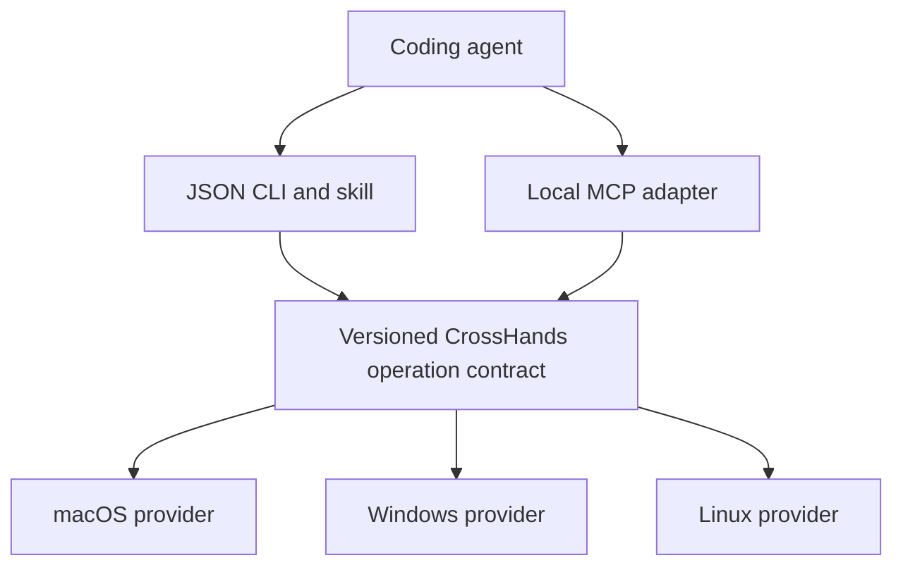
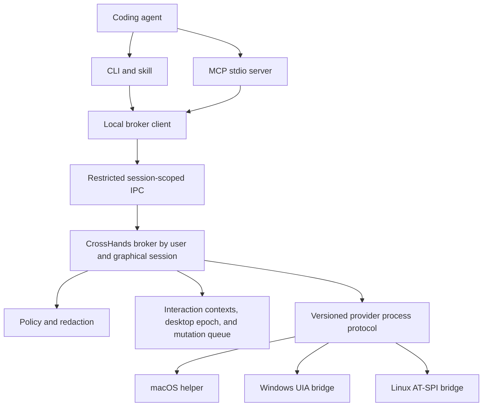
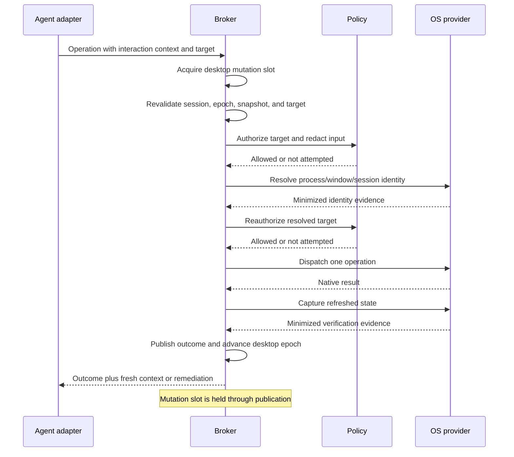
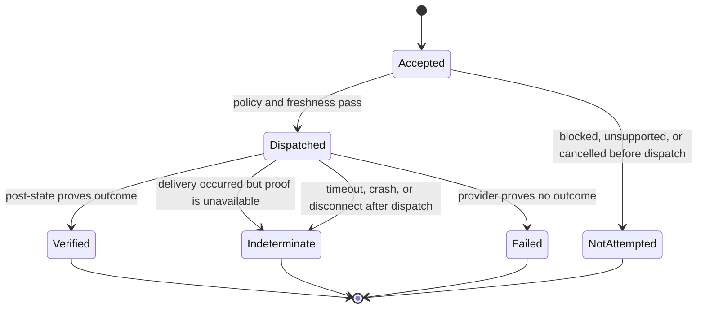
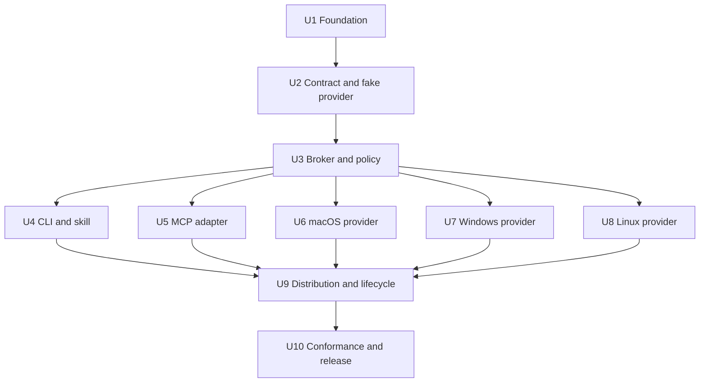

# CrossHands Computer Use Runtime - Plan

## Goal Capsule

- **Objective:** Define the first release of CrossHands as a standalone, agent-agnostic computer-use runtime with Orca-familiar behavior on macOS, Windows, and Linux.
- **Product authority:** This Product Contract owns CrossHands scope and acceptance behavior. Orca is the source and compatibility precedent, not the product authority.
- **Open blockers:** None block planning. Public open-source timing is intentionally deferred.
- **Execution profile:** Deep, contract-first, and cross-platform. Prove shared semantics with a fake provider before native automation, then develop platform providers in parallel.
- **Stop conditions:** Stop for user direction if implementation would change the Product Contract, add a network transport, weaken sensitive-target blocking, or remove a day-one platform.
- **Tail ownership:** U10 owns cross-platform conformance, reference-agent evidence, and the final release gate after every preceding unit is complete.

---

## Product Contract

### Summary

CrossHands will provide local desktop observation and interaction to coding agents without requiring the Orca application. A shared, versioned operation contract will be exposed through a JSON CLI with an installable skill and through a local MCP adapter.

### Problem Frame

Orca demonstrates useful cross-platform computer use, but consuming that capability currently requires installing the broader Orca product. Coding agents need a focused runtime they can invoke from their existing environments, test independently, and integrate through either shell commands or native MCP tools.

Remote control of a separate Windows machine is a motivating future use case. It is excluded from the first release because a remote desktop-control surface requires a security and trust model that has not yet been defined.

### Key Decisions

- **Standalone product:** CrossHands extracts and adapts only the computer-use capability needed by agents; it does not become an agent IDE or orchestration product.
- **One contract, two adapters:** The CLI and MCP surfaces map to the same operations, capabilities, errors, and verification semantics. MCP complements rather than replaces the CLI.
- **Compatibility-first evolution:** CrossHands preserves Orca-familiar command concepts and result meanings where they are product-independent, while removing Orca-specific session, worktree, packaging, and branding assumptions.
- **Cross-platform from the first release:** macOS and Windows are first-class optimization targets. Linux remains a supported day-one platform with a lower initial reliability threshold.
- **Local-only boundary:** The first release controls only the graphical desktop session on the machine where the CrossHands runtime runs.
- **Agent-agnostic core:** Codex, OpenCode, and Oh My Pi are reference clients, not privileged runtime dependencies.



### Actors

- A1. **Operator:** Installs CrossHands, grants operating-system permissions, and authorizes the coding agent's work.
- A2. **Coding agent:** Observes application state, selects actions, and verifies results through either adapter.
- A3. **CrossHands runtime:** Normalizes requests, applies safety rules, dispatches platform operations, and returns fresh state or explicit failures.
- A4. **Platform provider:** Uses the host operating system's accessibility, screenshot, input, and window-management capabilities.

### Requirements

**Product identity and compatibility**

- R1. CrossHands must install and run as a standalone computer-use product without requiring Orca, an agent IDE, or an orchestration host.
- R2. CrossHands must remain agent-agnostic while validating Codex, OpenCode, and Oh My Pi as first-release reference clients.
- R3. CrossHands must preserve Orca-familiar computer-use behavior and response meanings under CrossHands branding without retaining Orca-specific product concepts.
- R4. CrossHands must version its public operation contract so adapters and providers can evolve without silently changing behavior.

**Agent-facing surfaces**

- R5. CrossHands must provide a JSON CLI and an installable skill that teach agents the supported commands, safety boundaries, and observe-act-verify loop.
- R6. CrossHands must provide a local MCP adapter that exposes the same core operations as typed tools over the standard local process transport.
- R7. The CLI and MCP adapters must report equivalent capabilities, results, verification states, and error meanings for the same operation.

**Computer-use capabilities**

- R8. CrossHands must provide permissions and capability inspection, running-application discovery, window discovery, accessibility-state capture, and screenshot capture.
- R9. CrossHands must provide element-based and coordinate-based clicking, secondary accessibility actions, value setting, literal typing, exact paste, individual keys, hotkeys, scrolling, and dragging.
- R10. CrossHands must treat element and window references as short-lived and require fresh state after navigation, focus changes, scrolling, window changes, or application rerenders.
- R11. Every state-changing action must return verified fresh state or an explicit result that the agent can verify; CrossHands must not report unverified work as successful.

**Platforms, setup, and safety**

- R12. CrossHands must support macOS, Windows, and Linux in the first release, with reliability optimized first for macOS and Windows.
- R13. CrossHands must guide the operator through required permissions and expose a smoke test that works without editing internal files.
- R14. CrossHands must block known sensitive applications by default and provide input paths that keep secrets out of shell history and routine logs.
- R15. CrossHands must return actionable errors for missing permissions, stale targets, unavailable applications or windows, invalid arguments, timeouts, and unsupported capabilities.

**Validation and licensing**

- R16. CrossHands must ship a compact conformance benchmark covering discovery, observation, screenshots, core actions, and stale-state recovery.
- R17. CrossHands must validate the core platform contract separately from reference-agent integrations rather than requiring every client-by-platform permutation.
- R18. CrossHands must use the MIT license and preserve Lovecast Inc.'s copyright and MIT permission notice for copied or substantially derived Orca code.

### Key Flows

- F1. **Install and become ready**
  - **Trigger:** A1 installs CrossHands on a supported desktop operating system.
  - **Actors:** A1, A3, A4
  - **Steps:** CrossHands checks provider availability, explains required permissions, and runs the platform smoke test.
  - **Outcome:** The runtime reports readiness or a specific setup action.
  - **Covered by:** R1, R12, R13, R15

- F2. **Observe, act, and verify through the CLI**
  - **Trigger:** A2 invokes the CrossHands skill for a local desktop task.
  - **Actors:** A2, A3, A4
  - **Steps:** The agent discovers the target, captures fresh state, selects an action, and inspects the returned state before continuing.
  - **Outcome:** The requested change is verified or the agent receives an actionable failure.
  - **Covered by:** R5, R8, R9, R10, R11, R15

- F3. **Observe, act, and verify through MCP**
  - **Trigger:** An MCP-capable reference client discovers the CrossHands tools.
  - **Actors:** A2, A3, A4
  - **Steps:** The agent calls typed tools that map to the same shared operations used by the CLI and follows the same freshness rules.
  - **Outcome:** MCP behavior is equivalent to the CLI behavior for the same platform operation.
  - **Covered by:** R6, R7, R8, R9, R10, R11

- F4. **Recover from changed or unavailable state**
  - **Trigger:** A target, window, element, permission, or platform capability is no longer usable.
  - **Actors:** A2, A3, A4
  - **Steps:** CrossHands returns a specific error and the agent refreshes state, chooses a supported alternative, or stops for operator action.
  - **Outcome:** The workflow recovers without treating a failed action as success.
  - **Covered by:** R10, R11, R15

### Acceptance Examples

- AE1. **Covers R7 and R11.** Given the same supported action through the CLI and MCP, when each adapter invokes it against equivalent fresh state, then both report equivalent results and verification status.
- AE2. **Covers R10 and R15.** Given an element reference from an earlier snapshot, when the application rerenders before the action, then CrossHands reports a stale or missing target and the agent refreshes state before retrying.
- AE3. **Covers R13 and R15.** Given a missing accessibility or screenshot permission, when the agent requests the affected operation, then CrossHands identifies the missing permission and does not report success.
- AE4. **Covers R14.** Given a known password-manager or secrets application, when an agent attempts to inspect or control it, then CrossHands blocks the target by default.
- AE5. **Covers R11 and R15.** Given an operation that the current provider cannot perform, when the agent invokes it, then CrossHands returns an unsupported-capability result rather than simulating success.

### Success Criteria

- The repeated deterministic benchmark reaches at least 95% successful task completion on macOS and Windows and at least 90% on Linux.
- Codex, OpenCode, and Oh My Pi each complete the reference benchmark through both the CLI skill and MCP adapter.
- Equivalent operations pass adapter-parity checks for capability reporting, results, errors, and verification status.
- The release benchmark contains no silent-success case: every state-changing action is verified or explicitly marked unverified or failed.
- A clean supported machine can install CrossHands, grant required permissions, and pass the smoke test without modifying internal project files.

### Scope Boundaries

**Deferred for later**

- Remote computer use, machine pairing, transport security, authorization, and remote audit controls.
- Deeper performance and reliability optimization inspired by projects such as CUA and Peekaboo.
- A larger computer-use benchmark catalog beyond the first-release conformance suite.
- OpenTelemetry instrumentation and broader operational observability.
- Optimized integrations for additional popular coding agents.
- The milestone at which the repository becomes publicly open source.

**Outside this product's identity**

- Agent orchestration, worktree management, or an agent IDE.
- A general-purpose desktop application UI.
- A hosted cloud control service.

### Dependencies and Assumptions

- The controlled operating system has an active graphical desktop session and exposes the permissions and accessibility facilities needed by its provider.
- Reference clients continue to support either local shell commands, local MCP servers, or both; their configuration details may change without changing the CrossHands core contract.
- Platform conformance and agent integration are separate validation axes. The first release does not require the full Cartesian product of every reference client on every operating system.
- Directly reused or substantially derived Orca code retains its original MIT notice even while public branding and product behavior use CrossHands names.

### Sources and Research

- CrossHands currently has no product implementation or prior product plan beyond `README.md`.
- Orca source snapshot: [`stablyai/orca@8adfef4`](https://github.com/stablyai/orca/tree/8adfef4ff80e7817b7c7bcd6b8ddf69289078c3c), including its computer-use skill, CLI surface, provider lifecycle, sidecar dispatch, and native platform helpers.
- [Orca computer-use documentation](https://www.onorca.dev/docs/cli/computer-use) for the public command surface and snapshot-act-refresh behavior.
- [Orca MIT license](https://github.com/stablyai/orca/blob/8adfef4ff80e7817b7c7bcd6b8ddf69289078c3c/LICENSE) for reuse and attribution obligations.
- [Model Context Protocol transports](https://modelcontextprotocol.io/specification/2025-11-25/basic/transports) and [tools](https://modelcontextprotocol.io/specification/2025-06-18/server/tools) for the local process adapter and typed-tool contract.
- [Oh My Pi releases](https://github.com/can1357/oh-my-pi/releases) for current MCP client support in the selected reference agent.

---

## Planning Contract

### Product Contract Preservation

Product Contract unchanged. Planning adds implementation decisions without altering R1-R18, A1-A4, F1-F4, AE1-AE5, success thresholds, or scope boundaries.

### Key Technical Decisions

- **Extraction-first stack:** Preserve Orca's TypeScript orchestration and native provider languages for v1. Use Node.js 22 or 24 LTS, pinned TypeScript 5.9, pnpm 10, Zod 4, and Vitest 4 rather than starting with a Rust or C++ rewrite.
- **Pinned compatibility baseline:** Compare behavior against `stablyai/orca@8adfef4ff80e7817b7c7bcd6b8ddf69289078c3c`. Maintain a ledger that marks every inherited operation, flag, field, error, and safety rule as kept, renamed, adapted, or excluded.
- **One schema authority:** Zod 4 definitions in the contract package are the runtime authority and generate JSON Schema 2020-12 artifacts for documentation, fixtures, and MCP metadata. Product version, public contract version, broker control protocol, provider process protocol/ABI, and MCP protocol version remain separate domains.
- **Graphical-session broker:** Exactly one local broker for each `(OS identity, graphical-session identity)` owns provider lifecycle, observation contexts, policy, action verification, desktop epoch, and a per-session mutation queue. Client handshake must agree on both identities and fail closed when no matching unlocked interactive session exists.
- **Restricted local IPC:** macOS and Linux use a user-only runtime directory and Unix-domain socket. Windows uses a named pipe restricted to the current logon identity. No TCP or HTTP listener exists in v1.
- **Broker-issued interaction contexts:** Observation returns an opaque, TTL-bound context that a later CLI process can carry into an action and that an MCP connection maps to the same abstraction. Every actionable reference is bound to that context, broker generation, graphical session, app, window, snapshot, and desktop epoch. Start from Orca's 32-entry and two-minute cache limits, then invalidate earlier on focus, window, navigation, scroll, mutation, or provider restart.
- **Honest action outcomes:** Mutations resolve as verified, indeterminate, failed, or not attempted. Blocked, unsupported, or pre-dispatch-cancelled work is not attempted; post-dispatch timeout or disconnect is indeterminate unless refreshed state proves an outcome.
- **Stable MCP v1 adapter:** Use `@modelcontextprotocol/sdk` 1.29.x over stdio and isolate all SDK-specific code. Do not target the pre-release v2 packages, MCP Tasks, Streamable HTTP, or legacy HTTP+SSE.
- **Platform-specific providers:** macOS uses a Swift 6 helper with Accessibility and ScreenCaptureKit. Windows initially adapts Orca's PowerShell 5.1 and .NET UI Automation bridge. Linux adapts the Python 3 and AT-SPI bridge with X11 as the full-conformance target.
- **Layered safety below adapters:** Providers perform stable-identity preflight, protected-field redaction, and content minimization before serializing desktop data. The broker applies the canonical allow/deny policy, payload limits, and secret-safe input rules before observation or action. No adapter or provider bypass exists in v1.
- **Versioned provider process boundary:** Providers are supervised child processes using a framed, versioned protocol with handshake, request IDs, deadlines, bounded messages, cancellation, EOF/crash semantics, and backpressure. The broker owns their lifecycle; providers depend only on the public contract/ABI, not broker or adapter internals. In-process FFI and per-operation process launch are rejected for v1 because they respectively collapse isolation and lose durable provider state.
- **Split distribution:** Publish a main JavaScript package and OS-specific optional payload packages. Runtime lookup is package-relative and never depends on Electron resource paths or the caller's working directory.
- **Two validation axes:** Deterministic provider and adapter conformance blocks release. Codex, OpenCode, and Oh My Pi benchmarks validate integration separately and do not replace provider correctness.
- **Same-user trust boundary:** V1 authenticates the active OS/logon identity and graphical session, not a particular agent process. Caller/interaction contexts isolate cooperative clients but are not authorization credentials. Same-user malicious processes are out of scope; the broker never elevates, runs as a service/session 0, or accepts network clients.
- **Non-spoofable target preflight:** Providers derive target identity from process start identity, session, executable identity, and available platform signature/publisher metadata. The broker re-resolves it after queue acquisition and immediately before dispatch. Unknown, changed, or coordinate-mismatched targets fail closed. Full-display capture is unsupported in v1 unless every captured surface can be classified and sensitive surfaces masked.
- **Transient sensitive data:** Accessibility content, titles, screenshots, literal input, and clipboard data are memory-only by default. Explicit screenshot export uses broker-created restrictive files, rejects links/special files and overwrite, and has bounded cleanup; no forensic secure-deletion claim is made. Secret stdin never falls back to clipboard, arguments, operation files, or diagnostics.
- **Immutable candidate promotion:** Build, sign, and hash each release artifact once, resolve the split package set from a non-default candidate channel, and run all blocking gates against those bytes. Promotion changes only registry channels/tags and never rebuilds. Until public open-source distribution is authorized, the target is a controlled restricted npm-compatible registry; the exact registry endpoint and access policy are recorded in release configuration before U9 candidate testing.
- **One-release compatibility floor:** V1 supports the immediately previous release for upgrade/downgrade or rejects an unsupported client, broker, provider, configuration, or payload pairing before desktop dispatch with explicit remediation. Activation switches only after a complete bundle verifies; interruption leaves the old or new bundle runnable, never a mix.

### High-Level Technical Design

The broker is the only component allowed to own desktop state or invoke a provider. Both adapters translate their envelopes into the same contract operations.



An action is revalidated after it acquires the mutation queue. This prevents a request that was fresh at receipt from acting on a window changed by another client.



The outcome state prevents native API delivery from being mistaken for task success.



### Supported Platform Matrix

| Platform | First-release target | Provider baseline | Release posture |
|---|---|---|---|
| macOS | macOS 14+, Apple Silicon and Intel | Swift 6 helper, AXUIElement, ScreenCaptureKit | Full conformance, signed stable helper identity, 95% threshold |
| Windows | Windows 10/11 x64, current user's interactive desktop | Windows PowerShell 5.1, .NET UI Automation, Win32 input/capture | Full conformance at equal integrity, 95% threshold |
| Linux | Ubuntu 24.04 LTS, GNOME on Xorg, x64 | Python 3, PyGObject, AT-SPI, GDK/GdkPixbuf, X11 utilities | Full declared matrix, 90% threshold |
| Linux Wayland | Ubuntu GNOME Wayland | AT-SPI with capability-reduced screenshot and input | Supported discovery/readiness with honest gaps; not the v1 90% denominator |

### Sequencing



### System-Wide Impact

- **Public contracts:** CLI JSON, MCP tools, provider ABI, compatibility fixtures, and documentation derive from one operation catalog. A change to that catalog affects all consumers.
- **Desktop authority:** The broker acts with the logged-in user's authority. OS permission grants, UAC secure desktop, lock screens, CAPTCHA, credentials, biometrics, and terms acceptance remain human-only boundaries.
- **Threat model:** The trusted principal is the current active interactive OS/logon identity, not Codex, OpenCode, OMP, or a specific process. Other users, logon sessions, remote named-pipe clients, lower-integrity callers, and unverifiable peers are rejected before request parsing. A malicious process already running as the same user is out of scope and must be stated as a limitation; CrossHands does not claim agent-specific enrollment or consent in v1.
- **State and concurrency:** All adapters attached to one graphical session share its desktop epoch and mutation queue. The mutation slot covers revalidation, authorization, dispatch, verification, epoch advance, and result publication; observations either queue behind it or explicitly report their epoch. Provider restart or package update invalidates every outstanding interaction context.
- **Privacy:** Accessibility text, screenshots, window titles, clipboard content, and literal input are transient and excluded from logs, stderr, error objects, crash diagnostics, persisted operation files, and future telemetry by default. Explicit exports and privacy-safe fixture evidence have named retention and cleanup rules.
- **Content trust:** Accessibility trees, screenshots, titles, and MCP results are untrusted application-controlled content. Agent instructions and MCP annotations are guidance only; broker-enforced identity, target, and secret policy remains authoritative.
- **Sensitive-target limit:** A denylist cannot recognize secrets rendered inside a general browser, terminal, editor, or custom canvas. The zero-tolerance gate covers the specified identity-swap, overlay, sensitive-app, and secure-field fixtures, not universal secret detection.
- **Release integrity:** The installed broker verifies a version-bound manifest and platform identity/hash before starting any provider from an absolute packaged path with a minimized environment. It never searches the working directory, shell/profile, executable path, Python module path, or PowerShell module/profile state.
- **Release infrastructure:** Headless CI proves contract and adapter behavior, but provider conformance needs interactive, permissioned, final-artifact runners on all three operating systems.

### Risks and Mitigations

| Risk | Impact | Mitigation |
|---|---|---|
| Orca behavior drifts during extraction | Compatibility becomes subjective | Pin the source commit and check golden contract fixtures plus a kept/adapted/excluded ledger |
| CLI and MCP diverge | Agents see inconsistent defaults or failures | Generate or validate both from one operation catalog and run normalized parity vectors |
| Concurrent callers race over focus or input | Wrong-window actions | Serialize mutations per graphical session, hold the slot through verification/publication, and epoch-stamp observations |
| Separate CLI processes cannot reuse caller-local references | Orca-style observe then act fails | Return opaque broker-issued interaction contexts with TTL, cross-process tests, and cross-client isolation |
| Broker attaches to the wrong login session | Actions affect an unintended desktop | Key broker/IPC by OS identity and graphical-session identity and require agreement during handshake |
| Client, broker, or provider versions disagree | Mixed semantics reach the desktop | Negotiate broker-control and provider-process versions before dispatch and fail with upgrade/downgrade remediation |
| Provider serializes sensitive content before policy runs | Denied data already crosses a trust boundary | Require provider-side identity preflight, secure-field redaction, and bounded content minimization |
| Same-user IPC is described as agent authentication | Operators overestimate isolation from local malware | Document the OS-identity trust boundary and treat caller contexts only as cooperative isolation |
| App names or windows are spoofed or swapped | Policy authorizes the wrong target | Bind platform-derived process/window identity to observations and re-resolve immediately before capture or dispatch |
| Screenshot/export path or clipboard fallback leaks data | Secrets persist outside the runtime | Use broker-created atomic restrictive files, bounded cleanup, no overwrite/links, and no secret-channel clipboard fallback |
| Runtime endpoint is precreated or weakly protected | Another user/session reaches desktop authority | Validate ownership/filesystem/mode, create locks/endpoints atomically, use explicit Windows logon-SID DACL, and fail closed |
| Provider payload or launch environment is substituted | Untrusted code inherits desktop authority | Verify signed version manifest and payload identity/hash, use absolute paths, and minimize the child environment |
| Session locks, switches, or changes integrity mid-action | Dispatch lands on a different desktop boundary | Recheck session/desktop/permission/integrity immediately before dispatch; return not attempted or indeterminate without retry |
| Native delivery is reported as success | Benchmarks and agents trust false outcomes | Require action-specific verification or return indeterminate |
| macOS signing identity changes | TCC grants break after upgrade | Fix bundle ID and signing identity before conformance; test packaged upgrades |
| Windows elevated or secure desktop is targeted | Actions fail or affect the wrong surface | Scope to equal-integrity interactive desktop and return explicit unsupported states |
| Linux Wayland is overstated | Release claim is unreproducible | Gate the 90% target on a named X11 matrix and capability-report Wayland gaps |
| Package omits or mutates native payload | Clean install fails despite source tests | Pack-install-smoke every OS artifact and verify signatures after final packaging |
| Benchmarks hide a broken primitive | Aggregate pass rate appears healthy | Report per-task numerator, denominator, and failure class with fixed repetitions |
| Tested bytes differ from promoted bytes | Release evidence does not describe the installed product | Publish immutable candidate digests, test registry-resolved packages, and promote the same digests without rebuilding |
| Split-package rollback yields mixed versions | Recovery cannot restore a usable runtime | Retain a last-known-good set, test rollback, move the main channel first, then payload channels, and deprecate rather than unpublish bad versions |

### Documentation and Operational Notes

- `README.md` becomes the install and positioning entry point and uses the canonical CrossHands brand.
- Compatibility documentation records the pinned Orca source, inherited notices, renamed command namespace, intentional deviations, and unsupported Orca-specific concepts.
- Platform setup docs explain permissions, supported session boundaries, prerequisites, reset steps, and capability-reduced environments.
- MCP integration docs cover stdio configuration for Codex, OpenCode, and Oh My Pi without making those clients runtime dependencies.
- Security, installation, CLI-skill, and MCP docs state the same-user trust boundary, sensitive-target limits, untrusted screen-content rule, and protected-input differences. MCP examples pin the exact installed executable/package version and show the command launched with the client's privileges.
- Release notes state the exact OS, architecture, desktop-session, package, contract, provider, and reference-agent versions used for validation.
- Release evidence links candidate digests, signed manifest, signer fingerprints, SBOM/notices, benchmark freeze, runner baselines, every failed/invalidated run, approvals, rollback drill, and post-promotion canaries with a stated retention owner and duration.

---

## Output Structure

```text
.
├── package.json
├── pnpm-workspace.yaml
├── pnpm-lock.yaml
├── tsconfig.base.json
├── vitest.workspace.ts
├── LICENSE
├── THIRD_PARTY_NOTICES.md
├── packages/
│   ├── contract/
│   ├── provider-testkit/
│   ├── runtime/
│   ├── cli/
│   ├── mcp/
│   ├── platform-darwin/
│   ├── platform-windows/
│   └── platform-linux/
├── native/
│   ├── macos/
│   ├── windows/
│   └── linux/
├── skills/computer-use/
├── integrations/
│   ├── codex/
│   ├── opencode/
│   └── omp/
├── fixtures/apps/
│   ├── macos/
│   ├── windows/
│   └── linux/
├── benchmarks/
│   ├── conformance/
│   └── agents/
├── tests/
│   ├── bootstrap/
│   ├── contract/
│   ├── broker/
│   ├── adapters/
│   ├── packaging/
│   └── e2e/
└── docs/
    ├── compatibility/
    ├── platforms/
    └── plans/
```

---

## Implementation Units

| Unit | Title | Key paths | Depends on |
|---|---|---|---|
| U1 | Repository foundation and provenance | root manifests, licensing, compatibility ledger | None |
| U2 | Contract catalog and fake provider | `packages/contract/`, `packages/provider-testkit/` | U1 |
| U3 | Broker, IPC, policy, and lifecycle | `packages/runtime/`, `tests/broker/` | U2 |
| U4 | JSON CLI and installable skill | `packages/cli/`, `skills/computer-use/` | U3 |
| U5 | MCP stdio adapter | `packages/mcp/`, `tests/adapters/` | U3 |
| U6 | macOS provider | `native/macos/`, `packages/platform-darwin/` | U3 |
| U7 | Windows provider | `native/windows/`, `packages/platform-windows/` | U3 |
| U8 | Linux provider | `native/linux/`, `packages/platform-linux/` | U3 |
| U9 | Distribution and installed lifecycle | platform packages, packaging tests, setup docs | U4-U8 |
| U10 | Conformance, agent validation, and release gate | fixtures, benchmarks, e2e, CI | U9 |

### U1. Repository Foundation and Provenance

**Goal:** Establish the greenfield toolchain, canonical branding, license, source provenance, and reproducible workspace before importing code.

**Requirements:** R1, R3, R4, R18

**Dependencies:** None

**Files:** `package.json`, `pnpm-workspace.yaml`, `pnpm-lock.yaml`, `tsconfig.base.json`, `vitest.workspace.ts`, `.oxlintrc.json`, `.oxfmtrc.json`, `.gitignore`, `README.md`, `LICENSE`, `THIRD_PARTY_NOTICES.md`, `docs/compatibility/orca-8adfef4.md`, `tests/bootstrap/package-metadata.test.ts`

**Approach:** Pin Node 22+ compatibility, TypeScript 5.9, pnpm 10, Zod 4, Vitest 4, formatting, linting, and package scripts. Record the exact Orca commit and Lovecast notice before importing source. Correct human-facing branding to CrossHands while reserving lowercase naming for commands and packages.

**Patterns to follow:** Orca's Node 24 and pnpm 10 baseline where it remains standalone-safe; the pinned Orca MIT license; no Electron or renderer dependencies.

**Execution note:** Treat this as provenance-first scaffolding. Import no Orca implementation until the compatibility ledger and notices exist.

**Test scenarios:**

1. A fresh workspace resolves the pinned package manager and installs with the lockfile unchanged.
2. Package metadata rejects unsupported Node versions and exposes the expected command entry points.
3. The license and third-party notice retain the required Orca copyright and permission text.
4. The compatibility ledger enumerates every operation in the pinned Orca CLI surface.

**Verification:** The workspace formats, lints, type-checks, and runs the bootstrap test from a clean checkout; no generated cache or build artifact appears as tracked content.

### U2. Contract Catalog and Fake Provider

**Goal:** Define the versioned operation, capability, target, snapshot, result, error, and provider contracts before implementing adapters or native automation.

**Requirements:** R3-R11, R15-R17; F2-F4; AE1, AE2, AE5

**Dependencies:** U1

**Files:** `packages/contract/package.json`, `packages/contract/src/`, `packages/contract/schemas/`, `packages/contract/test/`, `packages/provider-testkit/package.json`, `packages/provider-testkit/src/`, `tests/contract/`, `docs/compatibility/orca-8adfef4.md`

**Approach:** Build one Zod-backed operation catalog that emits JSON Schema artifacts and normalized fixtures. Separate product, public contract, broker control protocol, provider process protocol/ABI, and MCP versions. Observation issues an opaque TTL-bound interaction context reusable by a later CLI process; references bind to that context, process/window/session identity, broker/provider generation, snapshot, and desktop epoch. Preserve the Orca two-minute and 32-entry cache limits as starting defaults, and model verified, indeterminate, failed, and not-attempted outcomes. Provide a deterministic fake provider with scripted observations, rerenders, identity swaps, interleavings, timeouts, crashes, permission/session changes, and verification evidence.

**Patterns to follow:** Orca's runtime types, capability report, provider lifecycle, error normalization, screenshot bounds, and cache policy; strengthen them with explicit caller and snapshot scope.

**Execution note:** Start with failing contract vectors for Orca-compatible behavior and accepted CrossHands deviations.

**Test scenarios:**

1. Every public operation accepts valid input and rejects unknown, contradictory, or out-of-range fields.
2. Generated JSON Schema and runtime validation describe the same required and optional data.
3. A reference from another interaction context, graphical session, provider generation, process identity, app, window, desktop epoch, or expired snapshot is rejected before dispatch.
4. Mutations distinguish verified, indeterminate, failed, and not-attempted outcomes.
5. Every named Product Contract error maps to a stable machine code with retry and remediation metadata.
6. Orca-compatible fixtures remain stable while intentional deviations are documented.
7. One CLI process can observe and a later CLI process can act with the issued context, while another client cannot reuse or forge it.
8. Old/new client, broker, provider, and payload protocol pairs either satisfy the one-release compatibility floor or fail before provider dispatch with remediation.

**Verification:** Contract tests prove schema generation, compatibility fixtures, version negotiation, error taxonomy, reference freshness, and outcome semantics without invoking an OS provider.

### U3. Broker, IPC, Policy, and Lifecycle

**Goal:** Create one broker per OS identity and active graphical session that coordinates all adapters and providers without opening a network surface.

**Requirements:** R4, R7, R10, R11, R14, R15; F2-F4; AE2-AE5

**Dependencies:** U2

**Files:** `packages/runtime/package.json`, `packages/runtime/src/broker/`, `packages/runtime/src/ipc/`, `packages/runtime/src/policy/`, `packages/runtime/src/providers/`, `packages/runtime/test/`, `tests/broker/`

**Approach:** Auto-start one broker for each `(OS identity, graphical-session identity)` through an atomic lease and endpoint election. Validate Unix runtime-directory ownership, local filesystem, mode, and every path component; never fall back to a shared temporary directory. On Windows, create an explicit current-logon-SID DACL, reject remote clients, and verify PID, SID, logon session, and integrity before parsing. The broker assigns connection identity and interaction contexts; clients cannot choose or resume another client's identity. Negotiate the broker control protocol before operations and supervise a framed provider process protocol with request IDs, bounded messages, deadlines, cancellation, EOF/crash handling, and backpressure. The mutation slot remains held through revalidation, policy, dispatch, verification, desktop-epoch advance, and publication. Observations queue or return their epoch. Read-only observations may retry once after provider restart; mutations never auto-retry after dispatch.

**Patterns to follow:** Orca's sidecar/provider boundary and macOS tokenized socket; MCP local-security guidance; platform-native peer restrictions.

**Execution note:** Prove lifecycle and race behavior with the fake provider before connecting any native provider.

**Test scenarios:**

1. Separate CLI-like and MCP-like clients in the same graphical session share one broker/provider generation while retaining isolated broker-issued interaction contexts; cross-process CLI observe-then-act succeeds.
2. Concurrent mutations serialize through outcome publication, revalidate after queue acquisition, advance the desktop epoch, and reject newly stale targets; observations cannot expose a falsely concurrent state.
3. A mutation timeout after dispatch returns indeterminate and is not retried.
4. A read-only provider crash restarts once, invalidates old references, and returns a fresh generation.
5. Sensitive app observation, target-window screenshot, semantic action, and coordinate action are blocked identically after platform-derived identity is re-resolved; unknown identity, PID reuse, focus swap, overlay, or coordinate-window replacement fails closed.
6. Protected-field values and secret input never appear in logs, stderr, errors, crash diagnostics, persisted files, temporary captures, or clipboard fallback across validation, timeout, cancellation, and crash paths.
7. Different UID/SID, logon session, remote pipe client, lower-integrity caller, unverifiable peer, unsafe runtime directory, or precreated lock/socket/link is rejected before request parsing; simultaneous starters elect one compatible broker.
8. Compatible clients reuse an existing broker; incompatible broker-control versions fail with remediation. A stale endpoint recovers atomically, and a broker is never replaced while a mutation is active.
9. Provider handshake mismatch, malformed frame, oversized message, deadline, blocked output, EOF, and crash produce bounded outcomes and cannot bypass invalidation or replay a mutation.
10. Lock, fast-user-switch, secure-desktop, RDP-disconnect, permission-revocation, session-bus replacement, or provider-session transition returns not attempted before dispatch or indeterminate after dispatch unless fresh evidence proves the result.

**Verification:** Broker tests cover adversarial endpoint creation, exact peer/session checks, protocol negotiation, provider supervision/backpressure, interaction contexts, mutation/observation interleavings, cache/epoch limits, transition races, policy, transient-data cleanup, provider restart, and clean shutdown. Documentation calls same-user separation cooperative isolation rather than agent authentication.

### U4. JSON CLI and Installable Skill

**Goal:** Deliver the Orca-familiar `crosshands computer` command surface and agent guidance over the shared broker contract.

**Requirements:** R1-R5, R7-R11, R13-R15, R17; F1, F2, F4

**Dependencies:** U3

**Files:** `packages/cli/package.json`, `packages/cli/src/`, `packages/cli/test/`, `skills/computer-use/SKILL.md`, `integrations/codex/`, `integrations/opencode/`, `integrations/omp/`, `tests/adapters/cli-parity.test.ts`

**Approach:** Port the pinned Orca subcommands and flags under the CrossHands namespace, remove worktree/session and Electron assumptions, preserve JSON meanings, and keep human output separate from machine output. Observation JSON returns an opaque interaction context that later CLI invocations pass back for action. Add readiness, capability, and doctor surfaces. Secret values use a dedicated stdin channel that returns unsupported rather than falling back to clipboard, arguments, files, or diagnostics. Screenshot export is explicit: CrossHands creates a new restrictive file atomically, refuses overwrite, links/reparse points, and special files, returns metadata in JSON, and cleans broker-owned temporary captures on disconnect/restart/update/uninstall without promising forensic deletion. The skill teaches fresh-state discipline, human-only permission boundaries, same-user trust limits, untrusted on-screen content, sensitive-action policy, clipboard side effects, and recovery from explicit errors.

**Patterns to follow:** Pinned Orca CLI specs, handlers, formatting, and computer-use skill, adjusted according to the compatibility ledger.

**Test scenarios:**

1. Every kept command sends the expected normalized operation and renders contract-valid JSON.
2. Removed Orca-specific flags fail with migration guidance rather than being silently ignored.
3. Secret stdin reaches the broker without appearing in process arguments, output, or logs.
4. Screenshot exports are atomically created with restrictive permissions and bounded retention; existing paths, links/reparse points, special files, and overwrite attempts fail safely.
5. Permission, stale-reference, blocked-target, unsupported-capability, timeout, and indeterminate outcomes produce actionable machine and human output.
6. Codex, OpenCode, and OMP can discover the generic skill without changing runtime behavior.
7. An interaction context survives separate CLI process invocations, expires predictably, and cannot be forged or reused across cooperative clients.
8. Canary secrets remain absent from stdout/stderr, broker/provider diagnostics, temporary files, crash paths, screenshot metadata, and clipboard state.

**Verification:** CLI tests prove command coverage, JSON stability, exit behavior, secret-safe input, screenshot handling, broker auto-start, and skill examples against the fake provider.

### U5. MCP Stdio Adapter

**Goal:** Expose the same operation catalog as typed local MCP tools without duplicating provider or policy logic.

**Requirements:** R2, R4, R6, R7-R11, R14-R17; F3, F4; AE1, AE2, AE4, AE5

**Dependencies:** U3

**Files:** `packages/mcp/package.json`, `packages/mcp/src/`, `packages/mcp/test/`, `integrations/codex/`, `integrations/opencode/`, `integrations/omp/`, `tests/adapters/mcp-parity.test.ts`, `tests/adapters/stdio-cleanliness.test.ts`

**Approach:** Use `@modelcontextprotocol/sdk` 1.29.x and stdio only. Derive tool inputs, outputs, annotations, and instructions from the operation catalog while keeping all desktop work in the broker. Reserve stdout for JSON-RPC; stderr is an allowlisted diagnostic channel that excludes raw exceptions, operation envelopes, accessibility nodes, and literal input. Return structured contract results plus text-compatible fallbacks, label application-derived results as untrusted content, and close cleanly on client shutdown. Accurately annotate observations as read-only and actions/input as potentially destructive and open-world, while never treating annotations or client confirmation as policy. MCP literal arguments are not secret-safe; reject protected-field literal input with machine-readable remediation to the CLI secret channel. Integration examples pin an installed executable and package version and show the exact command launched with the client's privileges.

**Patterns to follow:** MCP 2025-11-25 tools and stdio transport; stable v1 SDK server patterns; shared adapter parity fixtures.

**Test scenarios:**

1. A spawned MCP process initializes, lists the full operation-derived tool set, invokes tools, and shuts down cleanly.
2. No log, warning, or stack trace corrupts stdout framing.
3. Invalid input fails at the adapter boundary and provider failures preserve CrossHands error and outcome semantics.
4. Normalized CLI and MCP results match for every operation, capability, error class, and verification state.
5. Codex, OpenCode, and OMP configuration fixtures discover and invoke the server.
6. Experimental Tasks, HTTP transports, resources, and prompts are absent from v1 unless required for tool discovery.
7. Tool annotations and instructions match operation effects, application-controlled results are marked untrusted, and broker policy is unchanged when annotations or confirmations are absent.
8. Protected-field literal input is rejected with CLI secret-channel remediation, and no literal value appears in captured host stderr or diagnostics.

**Verification:** Stdio integration and adapter-parity tests run against the fake broker and the packaged entrypoint on Node 22 and 24.

### U6. macOS Provider

**Goal:** Adapt the Orca macOS helper into a stable CrossHands permission identity with semantic automation and modern screenshots.

**Requirements:** R8-R16; F1-F4; AE2-AE5

**Dependencies:** U3

**Files:** `native/macos/Package.swift`, `native/macos/Sources/`, `native/macos/Tests/`, `packages/platform-darwin/package.json`, `packages/platform-darwin/assets/`, `tests/e2e/macos/`, `docs/platforms/macos.md`

**Approach:** Rebrand the Swift 6 helper and fix its bundle ID before permission testing. Preserve Accessibility traversal/action safety, bounded snapshots, socket authorization, and universal architecture builds. Replace the deprecated default screenshot path with ScreenCaptureKit on macOS 14+, keep permission preflight separate from runtime operations, and derive target identity from audit/session data, PID start identity, executable URL, bundle identity, and code-signing metadata before minimizing serialized content. Sign nested code, notarize distributable artifacts, verify the designated signing requirement before every launch, and keep the helper outside App Sandbox for v1.

**Patterns to follow:** Pinned Orca Swift helper, core tests, permission flow, build script, and socket transport; current Apple Accessibility and ScreenCaptureKit guidance.

**Test scenarios:**

1. The helper reports Accessibility and Screen Recording readiness independently and never automates their permission dialogs.
2. App/window discovery and accessibility snapshots handle multiple windows, missing IDs, truncation, and protected elements.
3. Each semantic and coordinate action returns refreshed state and action-specific verification.
4. A stale snapshot, provider restart, hidden/minimized window, mixed display scale, or unavailable screenshot returns the correct capability or error.
5. The final universal signed app keeps the same bundle identity across an upgrade and retains permission status where the OS allows.
6. Sensitive app and secure-field capture are blocked or redacted before screenshot/tree content leaves the helper.
7. PID reuse, renamed lookalikes, focus swap, sensitive overlays, coordinate-window replacement, and a new sensitive window during capture/action fail closed.

**Verification:** Swift unit tests, broker-provider conformance, signed-package inspection, permission smoke tests, and fixture-app E2E pass on both macOS architectures or their declared release runners.

### U7. Windows Provider

**Goal:** Adapt the Orca Windows bridge for reliable equal-integrity automation in the current user's interactive desktop.

**Requirements:** R8-R16; F1-F4; AE2-AE5

**Dependencies:** U3

**Files:** `native/windows/runtime.ps1`, `native/windows/tests/`, `packages/platform-windows/package.json`, `packages/platform-windows/assets/`, `tests/e2e/windows/`, `docs/platforms/windows.md`

**Approach:** Keep Windows PowerShell 5.1 as the initial runtime and invoke it non-interactively with `-NoProfile`, disabled module autoloading, an absolute packaged script path, minimized environment, and stdin/stdout rather than operation files. Use .NET UI Automation control patterns before Win32 input fallbacks, bound tree traversal and cross-process property reads, derive identity from PID start time, session/desktop, absolute executable, integrity, and Authenticode publisher/hash metadata, and treat foreground restore as best-effort with verification. Keep UIAccess, elevation, and service/session-0 execution out of v1.

**Patterns to follow:** Pinned Orca PowerShell provider and action validation; current Microsoft UI Automation, UIPI, input, named-pipe, and signing guidance.

**Test scenarios:**

1. Discovery and snapshots handle duplicate app names, multiple windows, missing stable IDs, password fields, and bounded trees.
2. UI Automation control patterns verify value, invoke, selection, toggle, and focus changes before input fallback.
3. Elevated targets, UAC secure desktop, lock screen, another user session, and unavailable foreground activation return explicit non-success states.
4. Timeouts and process termination do not replay a dispatched mutation.
5. Unicode, modifier cleanup, clipboard side effects, multi-monitor coordinates, and mixed DPI remain observable and bounded.
6. The installed payload works from paths containing spaces on clean Windows 10/11 without PowerShell 7.
7. PID reuse, publisher mismatch, renamed lookalike, focus/overlay/window replacement, UAC/lock/RDP transition, and poisoned profile/path/module environment never reach an unauthorized dispatch.

**Verification:** Provider bridge tests, broker conformance, interactive Windows fixture E2E, installed-package smoke tests, and artifact-signing checks pass on the declared x64 matrix.

### U8. Linux Provider

**Goal:** Adapt the Orca Linux bridge with a reproducible X11 conformance target and honest Wayland capability reporting.

**Requirements:** R8-R17; F1-F4; AE2-AE5

**Dependencies:** U3

**Files:** `native/linux/runtime.py`, `native/linux/tests/`, `packages/platform-linux/package.json`, `packages/platform-linux/assets/`, `tests/e2e/linux/`, `docs/platforms/linux.md`

**Approach:** Use Python 3 isolated mode, PyGObject, AT-SPI, GDK/GdkPixbuf, and absolute X11 utility paths in the active user's session with a minimized environment and no caller-controlled module/search path. Preflight system packages, payload hashes, process/session identity, executable identity, and the accessibility D-Bus instead of installing them silently. Gate the 90% benchmark on Ubuntu 24.04 GNOME Xorg. On Wayland, report reduced screenshot/hotkey/input capabilities and do not simulate X11 behavior; XDG portal automation remains deferred.

**Patterns to follow:** Pinned Orca Python provider, capability report, payload bounds, and dependency checks; current AT-SPI and PyGObject guidance.

**Test scenarios:**

1. Missing Python modules, AT-SPI service, session bus, display, GDK, clipboard tool, or X11 utility produces a precise readiness result.
2. X11 discovery, snapshots, screenshots, semantic actions, keys, hotkeys, scrolling, dragging, and clipboard paths satisfy the provider contract.
3. Wayland starts with a reduced capability report and never attempts unsupported X11 screenshot or hotkey paths.
4. Headless, locked, or non-interactive sessions report provider unavailable rather than returning an empty successful snapshot.
5. Unicode, truncation, secure fields, multiple windows, coordinates, and stale snapshots match shared contract semantics.
6. A clean Ubuntu package install documents and detects every required system package.
7. PID reuse, renamed lookalikes, focus/overlay/window replacement, session-bus/lock transition, and poisoned working-directory/path/module environment fail closed or return explicit non-success.

**Verification:** Python/provider tests, X11 fixture E2E, Wayland degradation tests, broker conformance, and installed-package smoke tests pass on the declared Ubuntu matrix.

### U9. Distribution and Installed Lifecycle

**Goal:** Produce clean-installable, version-matched packages with stable native identities, readiness diagnostics, atomic updates, and complete uninstall behavior.

**Requirements:** R1, R4, R12, R13, R15, R18; F1; AE3

**Dependencies:** U4, U5, U6, U7, U8

**Files:** `packages/platform-darwin/`, `packages/platform-windows/`, `packages/platform-linux/`, `scripts/build-native/`, `scripts/package/`, `tests/packaging/`, `.github/workflows/package-smoke.yml`, `.github/workflows/release.yml`, `docs/platforms/`, `README.md`

**Approach:** Produce a main package plus OS/CPU-constrained optional payload packages whose versions must match. A signed release manifest binds product/contract/control/provider versions, JavaScript entrypoints, scripts, native payloads, hashes, signer identities, SBOM, and notices. Provider launch verifies the manifest plus macOS designated requirement, Windows Authenticode publisher/timestamp/chain and payload hash, or Linux/script hash; failure is a provider-integrity error. Resolve only absolute package-relative assets and launch with a minimized environment.

Build and sign each candidate exactly once, record digests, publish payloads then the main package to a non-default candidate channel in the configured restricted npm-compatible registry, and test install/update/uninstall/conformance/agents by resolving that channel. Promotion moves the exact digests to the default channel without rebuilding; any digest, signature, notice, or version mismatch stops release. Retain a last-known-good complete package set. Rollback moves the main default channel first, then matching payload channels, deprecates the bad version without unpublishing it, and preserves evidence.

Updates stage and verify a whole versioned bundle, drain or reject mutations, then atomically switch activation and restart the broker. Interruption leaves the old or new bundle runnable. The immediately previous release is supported for upgrade/downgrade; other mixed versions fail before desktop dispatch. Lifecycle tests cover reinstall, upgrade, rollback, broker crash, connected clients, and reinstall after uninstall. Uninstall removes only CrossHands-owned broker registrations, IPC, caches, logs, and temporary captures; user-owned exports/configuration are preserved, and manual OS permission revocation is documented.

**Patterns to follow:** npm package `files`, `bin`, `os`, `cpu`, and optional dependency semantics; Orca native build inputs without Electron packaging assumptions.

**Test scenarios:**

1. Each OS installs only its compatible payload and rejects or diagnoses version mismatch and missing payloads.
2. The CLI and MCP entrypoints work outside the repository and from paths containing spaces.
3. macOS signatures/notarization, Windows signatures, executable bits, helper identity, and packaged checksums survive final packing.
4. Doctor distinguishes missing payload, dependency, permission, session, integrity, and unsupported-environment conditions.
5. Old CLI/new broker, new CLI/old broker, old MCP/new broker, provider/payload mismatch, missing partial payload, and broker restart either satisfy the one-release compatibility floor or fail before desktop dispatch with upgrade/downgrade guidance.
6. Interrupted staging/activation, update with connected clients, and downgrade leave one complete runnable bundle and invalidate all old interaction contexts without replaying mutations.
7. Uninstall after normal use or broker crash, reinstall, and orphan cleanup leave no CrossHands-owned process/IPC/temp state, preserve user-owned exports/configuration, and report permission entries the user must remove manually.
8. Modified/substituted payloads, changed signer, poisoned CWD/search path/Python path/PowerShell profile or module path, and manifest mismatch prevent provider launch.
9. Registry-resolved candidate package digests equal the signed manifest and the later promoted default-channel digests; the tested last-known-good downgrade and channel rollback drill succeed.

**Verification:** Pack inspection, post-pack/post-extract signature validation, clean-project registry install, install-use-upgrade-use, reinstall, interruption, rollback/downgrade, uninstall/orphan cleanup, provider-integrity tamper tests, and final-artifact smoke pass for every release package. Release-signing and backup owners approve signer fingerprints, timestamp/notarization evidence, credential-expiry margin, and manifest digests; credentials never enter packages or interactive runners.

### U10. Conformance, Agent Validation, and Release Gate

**Goal:** Turn the Product Contract success criteria into reproducible release evidence across providers, adapters, and reference agents.

**Requirements:** R2, R7-R17; F1-F4; AE1-AE5; all Success Criteria

**Dependencies:** U9

**Files:** `fixtures/apps/macos/`, `fixtures/apps/windows/`, `fixtures/apps/linux/`, `benchmarks/conformance/`, `benchmarks/agents/`, `tests/e2e/`, `.github/workflows/conformance.yml`, `.github/workflows/agent-benchmarks.yml`, `docs/platforms/`, `README.md`

**Approach:** Build purpose-made fixture apps with accessibility-visible state and an independent test oracle. Before a candidate exists, freeze the task catalog, fixture version, normalization, mandatory matrix, 100 repetitions per mandatory deterministic task/cell, timeout, retry, exclusion, invalid-run, and infrastructure-failure rules. Thresholds apply to every mandatory task in every full-conformance cell, not an aggregate: macOS/Windows require at least 95/100 and Linux at least 90/100. Product failures and automatic retries remain in the denominator. A run is discardable only for a predeclared runner-infrastructure condition, and its original record remains evidence; tasks cannot be removed after results are known.

The candidate manifest freezes exact OS build, architecture, Node version, desktop/session, display/DPI layout, locale/IME, fixture, package digest, and permission baseline. The blocking floor is macOS 14's latest patch on Intel and Apple Silicon plus the latest stable macOS on Apple Silicon; Windows 10 22H2 and the latest GA Windows 11 on x64; and the latest Ubuntu 24.04 point release with GNOME Xorg on x64. Node 22 and 24 adapter/package gates both block. Every claimed platform/architecture receives final-artifact install and smoke evidence; each full-conformance cell runs the provider task suite. Freeze exact build numbers before the candidate rather than silently following moving `latest` labels.

Use resettable dedicated accounts or machine snapshots. Record active unlocked session, permission state, display/DPI, locale, fixture reset oracle, absence of competing input, and candidate digests before each blocking run. Exercise install → use → upgrade → use with real permission/signing identity. Run identical contract vectors through broker, CLI, and MCP. Zero-tolerance identity, peer, secret, payload-integrity, silent-success, and sensitive-target fixtures block regardless of aggregate score.

Reference-agent validation is separate: pin agent version, model/config, approval mode, network assumptions, integration fixture, and prompts. Codex on the primary macOS Apple Silicon cell, OpenCode on the primary Windows 11 cell, and OMP on the primary Ubuntu Xorg cell each run five times through CLI+skill and MCP and must complete at least four runs per adapter. Agent failure cannot waive provider conformance, but it blocks the corresponding v1 compatibility claim.

Release roles are recorded as release coordinator/go-no-go owner, macOS/Windows/Linux provider owners, signing/provenance owner plus backup, benchmark adjudicator, rollback owner, and issue/security intake owner. Each signs the immutable evidence manifest. Promote only the tested candidate digests, then install from the actual default channel on one clean machine per platform, verify delivered hashes, run doctor/handshake/MCP initialization, and perform one verified fixture mutation through each adapter. Check at promotion, 1 hour, 6 hours, and 24 hours; any signature, install, broker, adapter, safety, or silent-success failure triggers channel rollback and candidate deprecation.

**Patterns to follow:** Orca's opt-in TextEdit, Notepad, and gedit E2E as a baseline; strengthen with purpose-built fixtures, independent semantic oracles, and final-package execution.

**Execution note:** Provider conformance is release-blocking. Reference-agent benchmarks may run nightly or on release candidates but must pass before v1 is declared ready.

**Test scenarios:**

1. Fixture apps cover discovery, duplicate names, multiple windows, value/invoke/toggle/selection/focus, keys, hotkeys, scroll, drag, secondary actions, screenshots, secure fields, rerenders, and stale references.
2. Multi-monitor, negative-origin, mixed-scale, minimized, occluded, off-screen, Unicode, IME, clipboard, timeout, cancellation, crash, and concurrent-client cases retain correct outcomes.
3. Direct broker, CLI, and MCP vectors produce schema-valid normalized parity for every capability, result, error, and verification state.
4. Each mandatory deterministic task meets its per-platform threshold over fixed repetitions with numerator, denominator, and failure class retained.
5. Codex, OpenCode, and OMP meet their separately frozen 4/5 acceptance rule through CLI+skill and MCP with final fixture state as the oracle.
6. A release with any silent success, sensitive-target leak, corrupted MCP stdout, unsigned required artifact, failing mandatory primitive, unreviewed exclusion, unavailable mandatory runner, or failed rollback drill is rejected regardless of aggregate score.
7. Different-user/session/remote/unverifiable peers never reach request parsing; identity swap, overlay, stale process, coordinate replacement, and unclassified targets never reach unauthorized observation or mutation.
8. Canary secrets never appear in CrossHands-owned logs, stderr, temporary files, crash diagnostics, clipboard fallback, persisted metadata, or retained evidence across success and every failure path.
9. Modified, unsigned, mismatched, or launch-environment-substituted provider payloads are never launched.
10. A prompt-injection characterization fixture records how each reference agent treats malicious on-screen text without making agent obedience a broker security claim.
11. Last-known-good downgrade, split-package registry rollback, same-digest promotion, and 24-hour clean-machine canaries complete with recorded owners and decisions.

**Verification:** The release manifest links candidate/default-channel package digests, signatures/signer fingerprints, SBOM/notices, exact matrix and runner baselines, frozen benchmark definitions, per-run outcomes and classifications including failed/invalidated runs, agent configs, approvals, rollback drill, and canaries. Raw accessibility text, screenshots, clipboard content, and literal input are not retained; privacy-safe detailed fixture evidence is access-controlled by the release coordinator for one year, while signed manifests and aggregate reports remain with the release. Missing or inconsistent evidence is a no-go.

---

## Verification Contract

| Gate | Command or environment | Proves | Blocking |
|---|---|---|---|
| Workspace install | `corepack pnpm install --frozen-lockfile` | Reproducible dependency graph on Node 22 and 24 | Every CI run |
| Static quality | `corepack pnpm lint` and `corepack pnpm typecheck` | Formatting, lint, type, and generated-schema consistency | Every change |
| Fast tests | `corepack pnpm test` | Contract, fake provider, broker, policy, CLI, MCP, and packaging logic | Every change |
| Build | `corepack pnpm build` | JavaScript packages and host-native payload compile for the current platform | Every change |
| Adapter parity | `corepack pnpm test:adapters` | CLI and MCP normalize the same operations and outcomes | Every change |
| Native units | `corepack pnpm test:native` | Swift, PowerShell bridge, and Python provider unit suites on applicable hosts | Platform changes |
| Package smoke | `corepack pnpm test:pack` | Packed artifacts install, resolve helpers, and run doctor/handshake outside the repo | Package and release changes |
| Security boundary | `corepack pnpm test:security` | Peer/session rejection, target identity, canary-secret lifecycle, endpoint races, and payload tamper gates hold | Runtime, provider, package, and release changes |
| Upgrade and rollback | `corepack pnpm test:lifecycle` | One-release compatibility, interrupted activation, downgrade, uninstall, and registry rollback preserve a complete runnable bundle | Package and release changes |
| Provider conformance | `corepack pnpm test:conformance` | Real interactive providers satisfy the declared capability matrix | Release candidate on each platform |
| Agent benchmark | `corepack pnpm benchmark:agents` | Codex, OpenCode, and OMP use both adapters to reach fixture outcomes | Nightly and release candidate |
| Release validation | `corepack pnpm release:validate` | Thresholds, zero-tolerance safety gates, signatures, package evidence, and docs are complete | Every release |

Headless CI runs workspace, static, fast, build, adapter, packaging-model, and security-model gates. Native, final-package security, lifecycle, provider conformance, agent benchmarks, and canaries run on interactive resettable runners with the final signed package identity and declared permission baseline.

---

## Definition of Done

### Global Completion

- The Product Contract remains unchanged and every R/F/AE that affects implementation is traced to at least one completed unit and verification gate.
- CLI and MCP expose the same versioned operation semantics, capabilities, errors, freshness rules, policy, and outcome states.
- Cross-process CLI workflows use broker-issued interaction contexts; broker and provider handshakes bind the same OS identity, graphical session, versions, and desktop epoch before dispatch.
- macOS and Windows deterministic tasks meet the 95% threshold; the declared Linux X11 matrix meets 90%.
- Codex, OpenCode, and Oh My Pi complete the reference benchmark through both adapters.
- No benchmark case reports silent success, leaks a sensitive target, corrupts MCP stdout, or bypasses a human-only OS boundary.
- No cross-user/session/remote/unverifiable peer reaches request parsing; no unclassified or identity-swapped target reaches observation/action; no canary secret persists; and no modified or substituted provider payload launches.
- Clean installed artifacts pass readiness and smoke tests on the declared platform matrix with required signatures and notices intact.
- The exact tested candidate digests are promoted without rebuilding, the immediately previous complete package set can be restored, and post-promotion canaries pass through the 24-hour decision window.
- Documentation covers installation, permissions, same-user trust limits, untrusted screen content, sensitive-target limits, protected input, capability limits, compatibility deviations, integrations, update, rollback, uninstall, and benchmark evidence.
- Remote mode, OpenTelemetry, hosted control, IDE/orchestration work, full Wayland automation, and broader optimization remain outside the implementation diff.
- Experimental, abandoned, superseded, and dead-end code is removed before completion.

### Unit Completion

| Unit | Done signal |
|---|---|
| U1 | Reproducible workspace, canonical brand, license, notices, and complete pinned compatibility ledger exist |
| U2 | Contract schemas, interaction contexts, version handshakes, fixtures, fake provider, freshness/epoch, error, and outcome tests pass |
| U3 | Session-keyed restricted IPC, provider protocol, mutation linearization, lifecycle, policy, transient-data, and recovery tests pass |
| U4 | Installed CLI and skill cover the kept Orca-familiar surface with stable JSON and secret-safe stdin |
| U5 | MCP stdio tools pass lifecycle, cleanliness, schema, and CLI parity tests |
| U6 | Signed macOS helper passes permissions, provider conformance, packaging, and fixture E2E |
| U7 | Windows bridge passes equal-integrity provider conformance, packaging, and fixture E2E |
| U8 | Linux X11 passes conformance and Wayland reports only proven capabilities |
| U9 | Immutable version-matched packages pass pack, registry install, integrity, update/interruption, downgrade/rollback, uninstall, signature, and doctor smoke tests |
| U10 | Signed evidence proves exact matrix thresholds, adapter parity, reference-agent acceptance, owners/approvals, rollback, canaries, and zero-tolerance safety gates |
