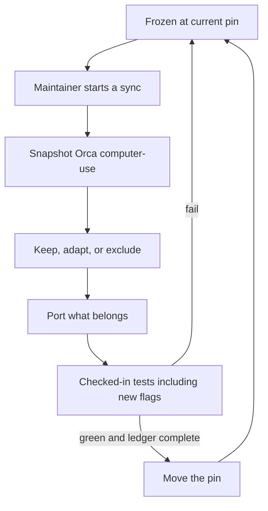
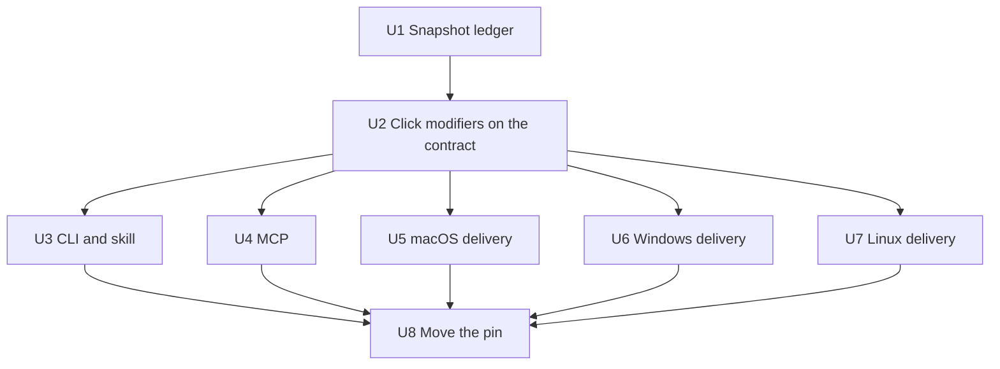

# On-Demand Orca Computer-Use Sync - Plan

## Goal Capsule

- **Objective:** Catch CrossHands computer-use up to current Orca computer-use on demand, then freeze until a maintainer starts another sync.
- **Product authority:** This Product Contract owns CrossHands scope and acceptance. Orca is the computer-use precedent, not the product authority.
- **Open blockers:** None block planning.
- **Execution profile:** Deep classify-then-port. Ledger first, then public contract and adapters, then native delivery, then one pin move.
- **Stop conditions:** Stop for user direction if a sync would add remote or network control, weaken sensitive-target blocking, drop a day-one platform, or import Orca sessions, worktrees, Electron, or ADE orchestration.
- **Tail ownership:** U8 owns the pin move after every port unit is green. Do not advance pin strings until then.

---

## Product Contract

### Summary

CrossHands will absorb current Orca computer-use through a maintainer-started sync: snapshot, classify keep/adapt/exclude, port what fits, then move the compatibility pin. After that, computer-use stays frozen until someone starts the same process again. Coding agents get current Orca-level operations and delivery without installing Orca.

### Problem Frame

CrossHands is already an Orca computer-use extract, pinned at `8adfef4`. Orca has kept moving as an ADE. The public computer command list has not grown, but native click, permission, and screenshot delivery has. There is no standing watch and no specific production failure driving this work. If nobody starts a sync, CrossHands stays frozen and agents do not pick up later computer-use capacity.

### Key Decisions

- **Computer-use only.** This sync covers local computer-use capacity, not the rest of Orca. (session-settled: user-directed — chosen over syncing the Orca ADE: CrossHands is a computer-use runtime.)
- **CrossHands stays the runtime.** Orca names, sessions, Electron, and skill-from-executable stay out. Broker-issued interaction context remains the CrossHands model. (session-settled: user-directed — chosen over remaining an Orca extract: the existing Product Contract is authority.)
- **Contract plus delivery.** Take later agent-visible operations, flags, and result meanings, and the native work that makes those operations complete. (session-settled: user-directed — chosen over public-contract-only and over copying the whole computer-use tree: flags without landing are empty capacity; a wholesale tree copy pulls ADE concepts.)
- **Frozen until an explicit sync.** The shipped pin does not track Orca live. The process may be repeated when a maintainer asks. (session-settled: user-directed — chosen over a drift signal and over a standing review cadence: default is freeze; sync is on demand.)
- **Checked-in tests gate the pin.** Schema, catalog, provider, and adapter tests must stay green, including coverage for absorbed flags. The live provider matrix and reference-agent release cells are not required to move the pin. (session-settled: user-directed — chosen over live v1 catalog, extending the frozen live catalog, and the full release bar: this is a compatibility catch-up, not a release.)
- **Classify, then port.** At sync start, snapshot Orca computer-use and mark every operation, flag, error meaning, and native delivery behavior keep, adapt, or exclude before porting. (session-settled: user-directed — chosen over delivery-first native backport and over treating Orca as an oracle without porting: a list-first filter is the existing compatibility practice and keeps session-shaped code out.)
- **Inventory comes from the snapshot.** Agent-visible flags are whatever Orca's public computer commands expose at sync start, not a pre-agreed list. Click modifiers are an example, not the inventory. (session-settled: user-approved — chosen over a fixed flag list: an on-demand sync has to classify what it actually finds.)
- **App-only Orca paths stay out.** A computer-use path that exists only for the Orca app, such as permission-status used off the public commands, is excluded unless it is agent-visible. (session-settled: user-approved — chosen over importing app-only RPC: agents consume CLI and MCP, not Orca's app.)
- **Linux stays in the absorb.** Native Linux delivery is part of capacity. Honest Linux capability reporting is not a reason to skip Linux. (session-settled: user-approved — chosen over macOS/Windows-only delivery: Linux is a day-one platform.)

### Actors

- A1. **Maintainer:** Starts an on-demand sync, accepts the keep/adapt/exclude list, and is the only actor who may move the pin.
- A2. **Coding agent:** Observes and operates the local desktop through the CLI skill or MCP using the absorbed computer-use capacity.
- A3. **Operator:** Grants OS permissions. Never automated by a sync.
- A4. **CrossHands runtime:** Applies the CrossHands-native filter, dispatches platform providers, and returns verified results or explicit failures.

### Requirements

**Sync ritual**

- R1. A computer-use sync starts only when a maintainer demands it and snapshots Orca computer-use at that moment.
- R2. Between syncs, CrossHands computer-use must remain frozen at the current pin and must not claim live Orca parity.
- R3. The same classify-then-port process must be repeatable later without changing CrossHands product identity.

**Capacity**

- R4. Each sync must classify every inherited computer-use operation, flag, error meaning, and native click, permission, and screenshot delivery behavior as keep, adapt, or exclude.
- R5. CrossHands must not drop an inherited computer-use primitive in order to sync.
- R6. Agent-visible flags and result meanings on Orca's public computer commands at snapshot time must appear on both CLI and MCP, or be excluded with a ledger reason.
- R7. Native delivery that makes those operations complete must be absorbed when it can be expressed without Orca product concepts.

**CrossHands-native filter**

- R8. Orca worktrees, agent sessions, Electron lifecycle, ADE orchestration, mobile, remote control, and skill-from-executable must stay excluded.
- R9. A computer-use path that exists only for the Orca app must stay excluded unless it is available on the public computer commands.
- R10. Linux native delivery remains in scope. Honest Linux capability gaps must not remove Linux from the sync.
- R11. CrossHands-native additions such as doctor and secret-safe input must remain.

**Pin-move gate**

- R12. The compatibility pin may move only when a keep/adapt/exclude ledger exists for that snapshot and checked-in contract, catalog, provider, and adapter tests stay green, including coverage for absorbed flags.
- R13. The live provider matrix and reference-agent release cells must not be required to move the pin.
- R14. Copied or substantially derived Orca computer-use code must keep Lovecast Inc. copyright and MIT permission notices.

### Key Flows

- F1. **On-demand sync**
  - **Trigger:** A1 starts a computer-use sync.
  - **Actors:** A1, A4
  - **Steps:** Snapshot current Orca computer-use. Classify operations, flags, errors, and native delivery. Port keep/adapt items under CrossHands names and the existing interaction-context model. Run checked-in tests, including coverage for new flags. Move the pin only if the ledger is complete and tests pass.
  - **Outcome:** CrossHands computer-use matches the snapshot under the CrossHands-native filter, then freezes.
  - **Covered by:** R1, R4, R5, R6, R7, R12

- F2. **Observe, act, verify after the pin moves**
  - **Trigger:** A2 runs a local desktop task through CLI or MCP.
  - **Actors:** A2, A3, A4
  - **Steps:** The agent uses the absorbed operations and flags. Mutations still return verified fresh state or an explicit unverified/failed result.
  - **Outcome:** Agent-visible capacity matches the new pin on both adapters.
  - **Covered by:** R6, R7, R11

- F3. **Stay frozen**
  - **Trigger:** Orca computer-use changes and nobody starts a sync.
  - **Actors:** A1, A2, A4
  - **Steps:** CrossHands keeps serving the current pin. No drift notice, no standing review, no live parity claim.
  - **Outcome:** Behavior stays at the last accepted snapshot.
  - **Covered by:** R2, R13

- F4. **Repeat later**
  - **Trigger:** A1 starts another computer-use sync.
  - **Actors:** A1, A4
  - **Steps:** Run F1 against a new snapshot with the same filter and pin-move gate.
  - **Outcome:** The pin advances again only if tests and ledger pass.
  - **Covered by:** R1, R3, R12

### Acceptance Examples

- AE1. **Covers R2 and R3.** Given a completed sync and a later Orca computer-use change, when no maintainer starts a sync, then CrossHands behavior and the published pin stay unchanged.
- AE2. **Covers R6 and R12.** Given an agent-visible flag on Orca's public computer commands at snapshot time, when the pin moves, then CLI and MCP both accept that flag and checked-in tests cover it, or the ledger records an exclude reason and the pin still does not claim the flag.
- AE3. **Covers R7 and R8.** Given native click or permission delivery that depends on Orca agent sessions, when the sync classifies it, then CrossHands absorbs the delivery behavior without session selectors and excludes the session model.
- AE4. **Covers R9.** Given an Orca permission-status path used only by the Orca app, when it is not a public computer command, then it is excluded.
- AE5. **Covers R12 and R13.** Given green checked-in tests, a complete ledger, and no live desktop or reference-agent evidence, when the maintainer finishes the sync, then the pin may move.
- AE6. **Covers R5 and R12.** Given a failing checked-in test or an inherited operation with no keep/adapt/exclude row, when the sync tries to finish, then the pin must not move.

### Success Criteria

- The new pin has a complete keep/adapt/exclude ledger for operations, flags, error meanings, and native delivery behaviors in the snapshot.
- No inherited computer-use primitive is missing without an exclude reason.
- Checked-in contract, catalog, provider, and adapter tests pass, including tests for absorbed flags.
- CLI and MCP remain equivalent for the same operation after the pin moves.
- The live 12-cell provider matrix and Codex / OpenCode / Oh My Pi release cells are not used as a pin-move gate.
- A later maintainer can start another sync using the same ritual without re-opening product identity.

### Scope Boundaries

**Deferred for later**

- Another on-demand sync after this one, against a newer Orca snapshot.
- A larger live computer-use catalog beyond the frozen first-release suite.
- Live provider-matrix or reference-agent evidence as a release gate, unchanged from the existing Product Contract.
- Deeper performance work inspired by other computer-use projects.

**Outside this product's identity**

- Orca ADE, worktrees, agent sessions, Electron, IDE, mobile, remote runtime, and orchestration.
- A live Orca-parity promise, drift watcher, or standing review cadence.
- Remote computer use, hosted control, and network transport.
- Replacing CrossHands interaction context with Orca sessions.
- Loading the computer-use skill from an Orca executable.

### Dependencies / Assumptions

- The current pin remains `stablyai/orca@8adfef4ff80e7817b7c7bcd6b8ddf69289078c3c` until this sync moves it.
- The existing CrossHands Product Contract still owns first-release identity: local-only, agent-agnostic, macOS and Windows as reliability targets, Linux as a day-one platform with honest gaps.
- At sync start, Orca's public computer command list is the capacity surface. As of 2026-09-07 that list still matched the 14 inherited operations, with later agent-visible delta concentrated in flags such as click modifiers and in native delivery rather than new commands.
- `computer.permissionsStatus` on Orca is app-side unless the snapshot shows it on public computer commands.
- CrossHands `doctor` is not an Orca computer command and stays.

### Outstanding Questions

**Resolve Before Planning**

- None.

**Deferred to Implementation**

- Whether macOS modifier clicks can land on the existing process-targeted click path, or need HID delivery that updates the current source-boundary tests.
- Exact helper names when extracting Orca native delivery into CrossHands types.

### Sources / Research

- Existing Product Contract and compatibility practice: `docs/plans/2026-07-10-001-feat-crosshands-computer-use-runtime-plan.md`, `docs/compatibility/orca-8adfef4.md`, `packages/contract/test/fixtures/orca-8adfef4.json`.
- Current public operations and extra `doctor` command: `packages/contract/src/operations.ts`, `packages/cli/src/index.ts`. Click has `clickCount` and `button`, not `modifiers`.
- Pin-move tests are checked-in only. Live suite is frozen separately: `README.md`, `docs/platforms/conformance.md` (`catalog.v1.json`, 28 tasks).
- Orca computer-use snapshot used for this plan: `stablyai/orca@9c8f4c398c3f8ba267cca14e0b65c3f6f87f2aa4` (main as of 2026-09-07). Public commands still the 14 operations. Agent-visible delta is click modifiers plus native delivery. `computer.permissionsStatus` is app-side, not a public computer command.

---

## Planning Contract

**Product Contract preservation:** Product Contract unchanged. The four former deferred planning questions are answered as Key Technical Decisions below.

### Key Technical Decisions

- **KTD1. First sync snapshot.** This implementation targets `stablyai/orca@9c8f4c398c3f8ba267cca14e0b65c3f6f87f2aa4`. If work starts against a newer main tip with no new public computer commands, record that SHA in the ledger instead. Do not leave the snapshot unpinned. Instantiates Inventory comes from the snapshot. (session-settled: user-approved — chosen over a pre-agreed flag list: classify what the snapshot actually has.)
- **KTD2. Ledger before ports.** Write the keep/adapt/exclude ledger for that SHA before changing contract, adapters, or natives. Instantiates Classify, then port. (session-settled: user-directed — chosen over delivery-first backport and over oracle-not-source.)
- **KTD3. Click modifiers are the new public flag.** Optional click `modifiers` uses the same token vocabulary as hotkey (`CmdOrCtrl`, `Shift`, and the rest). CLI `--modifiers`. MCP uses the same contract field. Omitted modifiers keep today's click behavior. Instantiates Contract plus delivery and R6.
- **KTD4. Non-empty modifiers skip accessibility primary click.** Shift/Cmd-click cannot be an accessibility press. All three platforms take the synthetic modifier-safe path when modifiers are present.
- **KTD5. Session-shaped natives stay out.** Port delivery that can run against process, window, and broker interaction context. Exclude Orca agent-session ownership, hangup monitors that exist only to reap session-owned helpers, app-only permission-status, skill-from-executable, worktrees, and Electron. Instantiates CrossHands stays the runtime. (session-settled: user-directed — chosen over remaining an Orca extract.)
- **KTD6. Preserve CrossHands-only safety.** Keep doctor, secret-safe stdin, SecureFieldMinimization, and broker interaction context even if later Orca dropped or never had them.
- **KTD7. macOS click delivery.** Prefer the existing process-targeted click path. Switch to HID only if that path cannot deliver modifier-safe clicks, and update the source-boundary tests in the same change. Absorb permission-trust settling and screen-capture preflight as post-grant readiness, never as programmatic permission prompts.
- **KTD8. Windows and Linux delivery.** Absorb modifier-safe clicks, Windows horizontal wheel for left/right scroll, and Linux modifier-safe clicks. Keep public `set-value` as a string; coerce types only inside the native write. Change `native/` and packaged `packages/platform-*/assets/` copies together.
- **KTD9. Version bump.** Bump `publicContract` when click input grows `modifiers`. Bump `providerProtocol` only if native IPC becomes incompatible. Do not add doctor to MCP. Instantiates Checked-in tests gate the pin. (session-settled: user-directed — chosen over the live release bar.)

### High-Level Technical Design

Contract remains the single catalog. CLI and MCP both map to it. Providers land delivery without Orca session types. The pin moves only after adapters and natives plus the ledger are green.

### Assumptions

- Orca main at the research SHA has no new public computer commands beyond the inherited 14.
- `computer.permissionsStatus` stays app-only in that snapshot.
- Existing live conformance catalog stays frozen; this sync does not add live tasks.

### Implementation Constraints

- Do not automate OS permission dialogs.
- Do not put secrets in CLI arguments or MCP literals.
- Do not require `test:conformance`, `benchmark:agents`, or `release:validate` to move the pin.
- Do not replace the shipped skill file with an executable-loaded guide.

### Sequencing

U1 then U2. U3–U7 after U2. U3 and U4 in lockstep so a flag never ships on one adapter only. U8 last.

---

## Implementation Units

### U1. Snapshot ledger

**Goal:** Classify the snapshot as keep, adapt, or exclude before any port.

**Requirements:** R1, R4, R5, R8, R9, R12; F1; AE3, AE4, AE6; KTD1, KTD2, KTD5

**Dependencies:** None

**Files:** `docs/compatibility/orca-8adfef4.md`, `docs/compatibility/orca-9c8f4c3.md` (or the SHA actually snapshotted), `packages/contract/test/fixtures/orca-8adfef4.json`, `packages/contract/test/fixtures/orca-9c8f4c3.json`

**Approach:** Copy the current ledger shape. Rows for every inherited operation, existing flags, click modifiers, native click/permission/screenshot behaviors, and excluded Orca product concepts. Mark permissions-status, sessions, Electron, worktrees, and skill-from-executable as exclude. Do not retarget README pin strings yet.

**Patterns to follow:** `docs/compatibility/orca-8adfef4.md` and `packages/contract/test/fixtures/orca-8adfef4.json`.

**Test scenarios:**

1. Covers AE4. The new ledger lists permissions-status as excluded because it is not a public computer command.
2. Covers AE6. Bootstrap-style checks fail if any of the 14 operations lacks a keep/adapt/exclude row.
3. Covers AE3. Session ownership is excluded; click delivery is adapt, not keep-as-Orca-session.

**Verification:** The new ledger and fixture exist and enumerate the 14 operations plus modifiers and the exclude list. Pin strings in README still name `8adfef4` until U8.

### U2. Public contract for click modifiers

**Goal:** Add snapshot-discovered click modifiers to the shared contract and regenerate schemas.

**Requirements:** R4, R6, R12; AE2; KTD3, KTD9

**Dependencies:** U1

**Files:** `packages/contract/src/operations.ts`, `packages/contract/src/versions.ts`, `packages/contract/src/provider.ts`, `packages/contract/schemas/contract.json`, `packages/contract/test/`, `tests/contract/catalog.test.ts`

**Approach:** Optional click modifiers on the existing click input. Same hotkey token vocabulary. Bump `publicContract` because the click schema grew. Keep the 14 operations. Do not add doctor or permissions-status to the catalog.

**Execution note:** Add failing catalog and schema tests for modifiers before changing the Zod input.

**Patterns to follow:** Existing `clickCount` and `button` optional fields; `packages/contract` `generate:schemas`.

**Test scenarios:**

1. Covers AE2. Click input with valid modifiers parses on the contract.
2. Unknown modifier tokens fail as invalid argument.
3. Catalog size stays 14 operations.
4. Regenerated `schemas/contract.json` matches live schemas.
5. After the public-contract bump, an older compatible-version set fails handshake rather than dispatching desktop work.

**Verification:** `corepack pnpm --filter @crosshands/contract test` and `tests/contract/catalog.test.ts` pass.

### U3. CLI and skill

**Goal:** Expose modifiers on `crosshands computer click` and teach agents the new path.

**Requirements:** R6, R11; F2; AE2; KTD3, KTD6

**Dependencies:** U2

**Files:** `packages/cli/src/index.ts`, `tests/adapters/cli-parity.test.ts`, `skills/computer-use/SKILL.md`

**Approach:** Allow `--modifiers` on click. Map to the contract field. Keep doctor and stdin secret channels. Update the shipped skill with modifiers, mouse-button, and “delivery is not success.” Do not load a guide from an executable.

**Patterns to follow:** `--click-count` / `--mouse-button` allowlists and mapping in `packages/cli/src/index.ts`; skill command sheet.

**Test scenarios:**

1. Covers AE2. `click --modifiers Shift+CmdOrCtrl` sends contract modifiers and returns JSON.
2. `--modifiers` on a non-click command is rejected.
3. Doctor still reports readiness.
4. Secret stdin still never appears in argv or stdout.
5. Skill examples include modifiers and still omit worktree/session.

**Verification:** `corepack pnpm test:adapters` covers the CLI vectors. Skill examples match allowed flags.

### U4. MCP adapter

**Goal:** Same click modifiers through MCP tools, equivalent to CLI.

**Requirements:** R6, R7; F2; AE2; KTD3, KTD9

**Dependencies:** U2

**Files:** `packages/mcp/src/index.ts`, `tests/adapters/mcp-parity.test.ts`

**Approach:** Tool schemas stay derived from `COMPUTER_OPERATIONS`. Modifiers appear on click only. Do not add a doctor tool. Protected-input rejection for type/paste/set-value stays.

**Patterns to follow:** `MCP_TOOL_CATALOG` from `Object.entries(COMPUTER_OPERATIONS)`; existing cli/mcp parity fixtures.

**Test scenarios:**

1. Covers AE2. MCP click with modifiers matches CLI normalized input.
2. Tool list length stays 14.
3. Literal protected input is still rejected with CLI stdin remediation.
4. Stdio stays JSON-RPC-clean.

**Verification:** `tests/adapters/mcp-parity.test.ts` and `tests/adapters/stdio-cleanliness.test.ts` pass.

### U5. macOS native delivery

**Goal:** Land modifier-safe clicks, permission-trust settling, and screenshot preflight without Orca sessions.

**Requirements:** R7, R8, R11; F2; AE3; KTD4, KTD5, KTD6, KTD7

**Dependencies:** U1, U2

**Files:** `native/macos/Sources/`, `native/macos/Tests/`, `packages/platform-darwin/src/index.ts`, `packages/platform-darwin/test/provider.test.ts`

**Approach:** Adapt click-delivery, permission settling, and preflight under CrossHands names and process/window identity. Preserve SecureFieldMinimization. Exclude AgentSessionOwnership. Prefer process-targeted clicks; HID only if modifiers cannot land, with boundary tests updated in the same change. Non-empty modifiers skip accessibility primary click. Trust settling is post-grant polling, not a permission prompt.

**Execution note:** Prove modifier-click and permission-preflight behavior in Swift tests before changing the helper’s click path.

**Patterns to follow:** `CrossHandsComputerUseMacOSCore` validation modules; existing permission preflight comments; provider mapping in `packages/platform-darwin/src/index.ts`.

**Test scenarios:**

1. Covers AE3. No session-ownership types in the helper public surface.
2. Click with modifiers does not use accessibility primary press.
3. Middle-click remains an honest unsupported or platform-supported result, not a silent left click.
4. Screen-capture preflight does not request permission.
5. Secure fields stay minimized.
6. Darwin provider forwards modifiers to the helper.
7. After permission-trust settling, a still-denied grant stays `operator_action_required` or `permission_denied` and never opens a system prompt.

**Verification:** macOS Swift tests and `packages/platform-darwin/test/provider.test.ts` pass. `corepack pnpm test:native` on macOS builds the helper.

### U6. Windows native delivery

**Goal:** Modifier-safe clicks and horizontal scroll on the Windows provider.

**Requirements:** R7, R10; F2; KTD4, KTD8

**Dependencies:** U1, U2

**Files:** `native/windows/runtime.ps1`, `native/windows/tests/`, `packages/platform-windows/assets/runtime.ps1`, `packages/platform-windows/src/provider.ts`, `packages/platform-windows/test/`

**Approach:** Atomic modifier down/click/up with cleanup. Left/right scroll uses horizontal wheel. Keep string `set-value`. Update native source and packaged asset together. No Orca Electron serve routing.

**Patterns to follow:** Existing `Send-CrossHandsMouseClick` and snake_case native params in `packages/platform-windows/src/provider.ts`.

**Test scenarios:**

1. Click with modifiers does not leave modifiers stuck.
2. Scroll left/right is not implemented as a vertical wheel.
3. Packaged `assets/runtime.ps1` matches the native source used in tests.
4. Provider maps contract modifiers into the native payload.

**Verification:** `packages/platform-windows/test` and `corepack pnpm test:security` include the Windows provider tests.

### U7. Linux native delivery

**Goal:** Modifier-safe clicks on Linux with honest capability reporting unchanged.

**Requirements:** R7, R10; F2; KTD4, KTD8

**Dependencies:** U1, U2

**Files:** `native/linux/runtime.py`, `native/linux/tests/`, `packages/platform-linux/assets/runtime.py`, `packages/platform-linux/src/index.ts`, `packages/platform-linux/test/provider.test.ts`

**Approach:** Modifier down/click/up with cleanup on the existing input path. Keep Wayland reduced-capability honesty. Update native source and packaged asset together.

**Patterns to follow:** Current AT-SPI/xdotool click path; Linux provider handshake.

**Test scenarios:**

1. Click with modifiers uses the synthetic path and cleans up keys.
2. Wayland still reports reduced screenshot/hotkey capabilities.
3. Packaged `assets/runtime.py` matches `native/linux/runtime.py`.
4. Provider forwards modifiers.

**Verification:** Linux provider tests pass. Native Python tests in `native/linux/tests/` cover modifier-click cleanup.

### U8. Move the pin

**Goal:** Advance every checked-in pin reference only after ports and tests are green.

**Requirements:** R2, R3, R12, R13, R14; F1, F3, F4; AE1, AE5; KTD1, KTD2, KTD9

**Dependencies:** U3, U4, U5, U6, U7

**Files:** `README.md`, `THIRD_PARTY_NOTICES.md`, `skills/computer-use/SKILL.md`, `native/macos/NOTICE`, `native/windows/NOTICE.md`, `native/linux/runtime.py`, `packages/platform-darwin/NOTICE`, `packages/platform-windows/NOTICE.md`, `packages/platform-linux/assets/runtime.py`, `tests/bootstrap/package-metadata.test.ts`, `docs/compatibility/`

**Approach:** Retarget the compatibility doc/fixture, notices, skill footer, and bootstrap assertions to the snapshot SHA. Keep Lovecast MIT notices on derived files. Do not run or require the live matrix.

**Patterns to follow:** Current pin-string set and `tests/bootstrap/package-metadata.test.ts`.

**Test scenarios:**

1. Covers AE5. Bootstrap and catalog tests pass with the new SHA and no live-evidence files.
2. Covers AE1. No remaining `8adfef4` computer-use pin claim except historical mention of the previous baseline.
3. Covers AE6. Tests fail if the ledger’s 14 operations or the “all represented” sentence is missing.
4. Doctor and stdin secret paths still exist after the pin move.

**Verification:** `corepack pnpm test`, `corepack pnpm lint`, and `corepack pnpm typecheck` pass. `test:conformance` and `benchmark:agents` are not pin-move gates.

---

## Verification Contract

Pin-move gates (required):

- `corepack pnpm lint`
- `corepack pnpm typecheck`
- `corepack pnpm test`
- `corepack pnpm test:adapters`
- `corepack pnpm test:security`

Not pin-move gates:

- `corepack pnpm test:conformance`
- `corepack pnpm benchmark:agents`
- `corepack pnpm release:validate`

Schema after U2: `corepack pnpm --filter @crosshands/contract generate:schemas` so `packages/contract/schemas/contract.json` matches.

On the current OS, `corepack pnpm test:native` proves the helper for that platform builds.

---

## Definition of Done

- Every keep/adapt/exclude row from U1 is either implemented or still excluded with a ledger reason.
- Click modifiers work on CLI and MCP with equivalent input.
- macOS, Windows, and Linux providers accept modifiers without Orca session types.
- Doctor, secret-safe stdin, and SecureFieldMinimization remain.
- Checked-in pin strings name the new snapshot.
- Abandoned HID or session-port experiments are not left in the tree.
- Live desktop and reference-agent evidence were not used as a ship gate.

**Per unit:** U1 ledger complete; U2 schema current; U3/U4 parity tests cover modifiers; U5–U7 provider tests cover modifier-safe clicks; U8 bootstrap and notices match the new SHA.

---

## System-Wide Impact

CLI, MCP, contract handshake, three native providers, the installable skill, and third-party notices all move together. A mixed-version bundle must still fail before desktop dispatch using existing version negotiation. Agents gain flags only when both adapters and the provider for their OS understand them.

---

## Risks & Dependencies

- **macOS click boundary.** HID delivery fights current process-targeted click tests. Mitigation: KTD7, prove modifiers on the existing path first.
- **Session leakage.** Orca helpers sit next to session ownership. Mitigation: U1 exclude rows and U5 source tests.
- **Split payloads.** Windows/Linux ship a second copy under `packages/platform-*/assets/`. Mitigation: KTD8 lockstep.
- **One-adapter flag.** Mitigation: U3 and U4 both depend on U2; U8 waits for both.
- **Orca HEAD drift during implementation.** Mitigation: KTD1 records the SHA actually snapshotted if main moved without new public commands.

**Upstream dependency:** read-only access to `stablyai/orca` at the snapshot SHA.

---

## Documentation / Operational Notes

- Replace the compatibility ledger for the new SHA and point README at it.
- Skill documents modifiers and verification caution; it stays a shipped file.
- Platform notes mention modifier-safe clicks only if operator-visible behavior changes.
- No new watcher, cron, or drift job.

---

## Alternative Approaches Considered

- **Delivery-first native backport.** Rejected in the Product Contract: session-shaped code sits next to click delivery.
- **Orca as oracle without porting.** Rejected: too slow for an on-demand freeze-by-default sync, and hard to prove without the live matrix.
- **Extend the frozen live catalog so modifiers are scored on interactive runners.** Rejected: this sync is not a release.

---

## Deferred to Follow-Up Work

- The next on-demand sync against a newer Orca snapshot.
- Live provider-matrix and reference-agent evidence as a later release gate.
- MCP-native doctor.
- macOS middle-click if it remains unsupported after this snapshot.
- Capturing the classify-then-port ritual in `docs/solutions/` after the pin moves.
